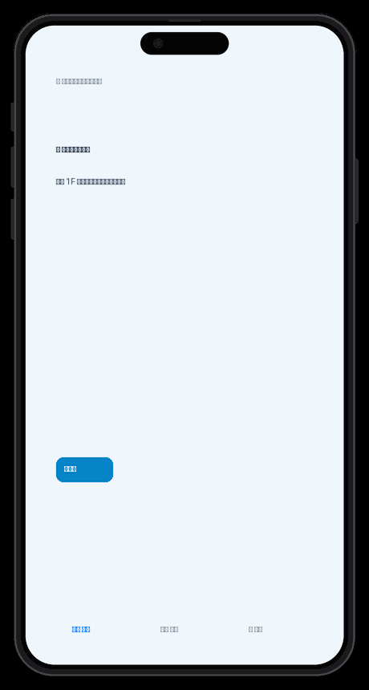
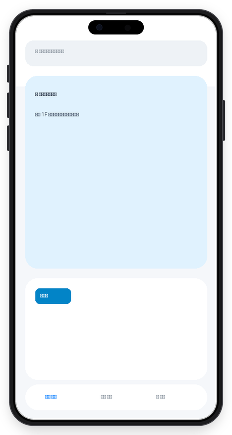
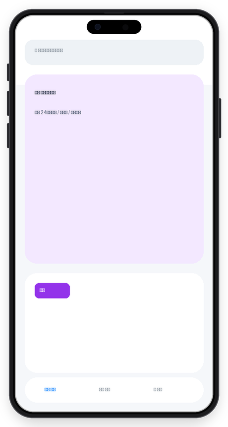
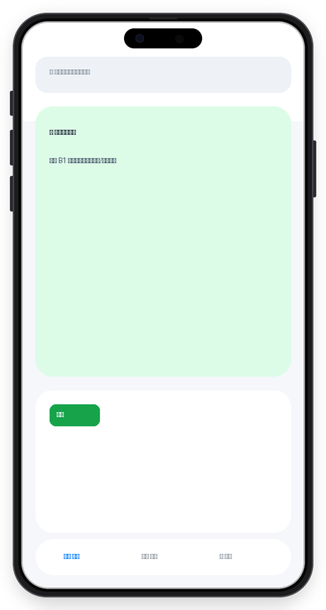
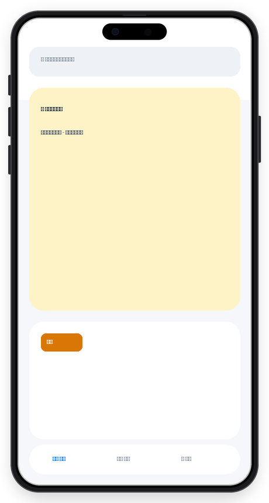

<div align="center">

# 💧 EasyFind - Public Restroom & Water Refill Station Finder
### 全台飲水機與公廁尋找神器 🚽

[](https://developer.apple.com/swiftui/)
[](https://developer.apple.com/ios/)
[](https://swift.org/)
[](https://developer.apple.com/xcode/)
[](https://data.gov.tw/)
[](LICENSE)

<br/>



<br/>

🔀 **[English Version](#-english) | [繁體中文版](#-繁體中文)**

---

</div>

<a name="english"></a>
## 🌐 English

### 📖 About EasyFind
**EasyFind** is a modern, intuitive iOS application crafted specifically for finding public amenities across Taiwan. Built using **SwiftUI**, **MapKit**, and **CoreLocation**, EasyFind provides instant access to nationwide public drinking water fountains and certified public restrooms. 

Whether you need a quick drink, specific water temperatures (cold/warm/hot), accessible restrooms, or 24/7 facilities, EasyFind delivers real-time distance calculations, interactive navigation, custom audio feedback, and community-driven issue reporting.

---

### ✨ Key Features

- 🗺️ **Interactive Map & Smart Location**: Browse nationwide water refill points and restrooms with smooth camera animation and instant distance updates from your current GPS position.
- 🔍 **Real-Time Autocomplete Search**: Type any location or facility name to see interactive auto-suggestions complete with category icons, full address, and calculated distance.
- 🎛️ **Three-Section Advanced Filters**:
  - **Administrative Region**: Filter by County/City and Town/District.
  - **Water Dispenser Specs**: Filter by Water Temperature options (**Cold** / **Warm** / **Hot**).
  - **Restroom Features**: Filter by **Accessible**, **Parent-Child**, or **Gender-Friendly** amenities.
  - **Operating Hours**: Toggle **24-Hour Access** facilities.
- ❤️ **Favorites Hub with Local Persistence**: Save your most visited locations with one tap. Favorites are saved locally on your device with dedicated search and filter options.
- 🔊 **Contextual Audio Interactions**: Built-in sound effects trigger when selecting map pins (drinking water flow sounds for dispensers, flush sounds for restrooms) with automated playback control on sheet dismissal or tab switching.
- 📢 **Facility Issue Reporting & Live Status Board**:
  - Direct issue reporting with pre-filled facility data.
  - Community board featuring maintenance statuses (**Under Maintenance**, **Repaired**, **Inspection Scheduled**, **Cleaned**).
- 🎨 **Custom Typography**: Embedded support for custom rounded font **jf-openhuninn 2.1 (粉圓體)** for a warm and modern visual aesthetic.

---

### 📸 Screenshots & Demo

<div align="center">

| 🗺️ Main Map & Detail Card | 🎛️ Advanced Filters | ❤️ My Favorites | 📢 Issue Reporting & Updates |
| :---: | :---: | :---: | :---: |
|  |  |  |  |

</div>

---

### 🛠️ Technical Architecture

| Component | Framework / Technology | Purpose |
| :--- | :--- | :--- |
| **UI Framework** | `SwiftUI` (iOS 17+) | Declarative user interface with `@Observable` architecture |
| **Map & Navigation** | `MapKit` | Interactive maps, camera controls, annotations, and navigation |
| **Location Services** | `CoreLocation` | Real-time device position, distance calculation, heading |
| **Audio Processing** | `AVFoundation` | Sound playback (`AVAudioPlayer`) for interactive map feedback |
| **Font Registration** | `CoreText` | Dynamic font registration (`CTFontManagerRegisterFontsForURL`) |
| **Data Persistence** | `UserDefaults` | Persistent storage for user favorite facilities |
| **Design Pattern** | `MVVM` | Clean separation between views, state managers, and repositories |

---

### 🚀 Getting Started & Installation

#### Prerequisites
- macOS 14.0 or later
- Xcode 15.0 or later
- iOS 17.0+ Simulator or physical device

#### Steps
1. **Clone the repository**:
   ```bash
   git clone https://github.com/your-username/EasyFind.git
   cd EasyFind
   ```

2. **Open the project in Xcode**:
   ```bash
   open "EasyFind.xcodeproj"
   ```

3. **Build & Run**:
   - Select your target simulator (e.g. *iPhone 15 Pro*) or connected iOS 17+ device.
   - Press `Cmd + R` to build and launch EasyFind.

---

<br/>

---

<a name="traditional-chinese"></a>
## 🇹🇼 繁體中文

### 📖 關於 EasyFind
**EasyFind** 是一款專為台灣在地使用者與旅客打造的「公共設施搜尋神器」。全專案基於 **SwiftUI**、**MapKit** 與 **CoreLocation** 打造，整合政府最新開放資料庫，協助使用者在第一時間找到身邊最近的**飲水機**與**優質公廁**。

無論您是需要即時補水（冰水/溫水/熱水）、尋找無障礙或親子廁所、亦或是尋找 24 小時開放設施，EasyFind 都能提供精準的距離計算、地圖導航、語音音效互動與即時故障通報功能。

---

### ✨ 核心功能特色

- 🗺️ **地圖即時定位與動態攝影機控制**：在地圖上流暢瀏覽全台飲水點與公廁標籤，動態計算與目前 GPS 位置的距離（公尺/公里）。
- 🔍 **關鍵字即時下拉關聯選單**：搜尋列輸入關鍵字即時浮現相關設施建議，呈現設施類型圖示、行政區地址與距離。
- 🎛️ **三分區進階條件篩選**：
  - **行政區位置**：按「縣市」與「鄉鎮市區」進行分區過濾。
  - **飲水機條件**：支援水溫選擇（**冰水** / **溫水** / **熱水**）。
  - **廁所條件**：支援特色設施過濾（**無障礙設施** / **親子/尿布台** / **性別友善**）。
  - **通用開放條件**：一鍵開啟 **24 小時全天開放** 設施。
- ❤️ **我的收藏與本地持久化儲存**：支援一鍵愛心收藏，資料永久保存於本地端，並提供專屬分頁進行類型分類與關鍵字搜尋。
- 🔊 **智慧情境音效播放**：點擊地圖設施時即時播放對應音效（飲水機流水聲、公廁沖水聲），並在關閉詳情或切換分頁時自動停止播放。
- 📢 **設施通報專區與即時動態消息**：
  - 從地圖詳情一鍵帶入設施資訊並進行故障回報。
  - 即時查看全台設施維護狀態通報板（**維護中**、**已修復**、**通報檢修**、**清潔完畢**）。
- 🎨 **圓潤溫馨字型**：動態載入客製化字型 **jf-openhuninn 2.1 (粉圓體)**，帶來舒適閱讀感受。

---

### 📸 應用程式畫面與截圖展示

<div align="center">

| 🗺️ 主地圖與設施詳情 | 🎛️ 三分區進階篩選 | ❤️ 我的收藏專區 | 📢 設施通報與即時消息 |
| :---: | :---: | :---: | :---: |
|  |  |  |  |

</div>

---

### 🛠️ 技術架構與採用技術

| 模組區塊 | 採用技術與 API | 說明與功能 |
| :--- | :--- | :--- |
| **UI 框架** | `SwiftUI` (iOS 17+) | 採用宣告式 UI 與 `@Observable` 狀態管理 |
| **地圖元件** | `MapKit` | 包含 `Map`、`Annotation`、`MapCameraPosition` 等現代地圖元件 |
| **定位服務** | `CoreLocation` | 處理 GPS 定位授權、即時座標更新與距離計算 |
| **音效模組** | `AVFoundation` | 使用 `AVAudioPlayer` 進行情境音效播放與停止控制 |
| **字型註冊** | `CoreText` | 動態註冊與載入外部 TrueType `.ttf` 字型檔 |
| **資料持久化** | `UserDefaults` | 儲存與同步使用者愛心收藏紀錄 |
| **架構模式** | `MVVM` | 職責分離，確保程式碼具備高度可維護性與擴充性 |

---

### 🚀 安裝與開發說明

#### 準備環境
- macOS 14.0 或更高版本
- Xcode 15.0 或更高版本
- iOS 17.0+ 模擬器或實體裝置

#### 開發步驟
1. **複製專案庫**：
   ```bash
   git clone https://github.com/your-username/EasyFind.git
   cd EasyFind
   ```

2. **使用 Xcode 開啟專案**：
   ```bash
   open "EasyFind.xcodeproj"
   ```

3. **編譯與執行**：
   - 選擇執行目標模擬器（例如 *iPhone 15 Pro*）或 iOS 17+ 實機裝置。
   - 按下 `Cmd + R` 即可開始編譯並體驗 EasyFind！

---

### 📄 License / 授權條款
This project is released under the **MIT License**. See [LICENSE](LICENSE) for details.  
本專案採用 **MIT 授權條款** 開放授權。
